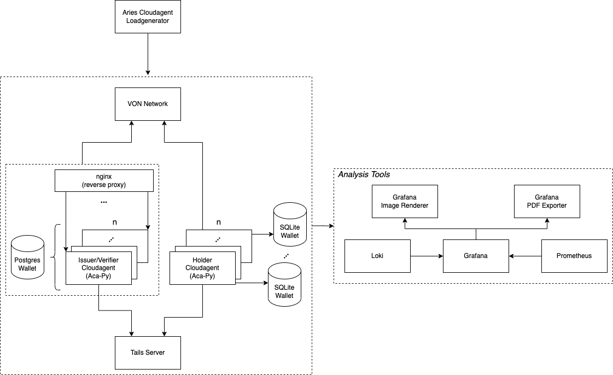

# Aries Cloud Agent Load Generator

A simple load generator to test the performance of the ACA-PY agent.



This repository comes with an automated testing setup consisting of:

- n Issuer/Verifier [ACA-Py](https://github.com/hyperledger/aries-cloudagent-python) instance(s) depending on the [configuration](#configuration) (+ 1 shared Postgres Wallet DB)
- nginx as reverse proxy for the Issuer/Verifier instances
- n Holder [ACA-Py](https://github.com/hyperledger/aries-cloudagent-python) instance(s) (+ SQLite Wallet DB for each one)
- [Tails Server](https://github.com/bcgov/indy-tails-server/) to support revocation
- [VON-Network](https://github.com/bcgov/von-network) for a local deployment of an indy ledger
- Analysis Tools ([see below](#analysis-tools))
- Aries Clouadagent Load Generator itself

## Getting Started
### Prerequisites

You need to have [Docker](https://docs.docker.com/get-docker/)
and [Docker-Compose](https://docs.docker.com/compose/install/) installed and access to a basic command line.

### Configuration

To configure the environment create a `./setup/.env` file similar to [./setup/.env.example](./setup/.env.example)

Declarative deployment approach is used. 
All variables in the `./setup/.env` which have prefix `SYSTEM_` indicate what and how components must be deployed.

- `SYSTEM_LEDGER=true` -  ledger will be deployed
- `SYSTEM_ISSUER_POSTGRES_DB=true` - Postgres database wallet will be deployed
- `SYSTEM_ISSUER_POSTGRES_DB_CLUSTER=true` - Postgres database will be deployed as cluster
- `SYSTEM_METRICS_DASHBOARD=true` - Dashboard to collect system metrics will be deployed
- `SYSTEM_AGENTS=true` - Issuers and Holders will be deployed
- `SYSTEM_LOAD_GENERATOR=true` - Load generator which immediately generates load is deployed

### Management Script

To start the environment and execute the load generator run:

```
./setup/manage.sh start
```

This will start all necessary components as well as registering a DID from the given seed in the `.env` file. The Load Generator itself is also included as a Docker container using this command.

To restart the environment, run:

```
./setup/manage.sh restart
```

If stop the system, delete all data, and remove all containers, run:

```
./setup/manage.sh down
```

## Analyze the Test Results

This project includes a setup for analyzing and visualizing the test results. The whole analysis setup is started
automatically when starting the test environment and available under http://localhost:3000/d/0Pe9llbnz/test-results.

### Analysis Tools

- **Grafana:** is used to visualize the collected data on a dashboard
- **Grafane Image Renderer:** used to render Grafana graphs as images to export them to a PDF (uses
  the [Image Renderer Plugin](https://grafana.com/grafana/plugins/grafana-image-renderer/))
- **Grafana PDF Exporter:** used to export a Grafana dashboard as a PDF (
  uses [IzakMarais/reporter](https://github.com/IzakMarais/reporter))
- **Grafana Loki:** is used to collect logs from services like the Load Generator
- **Prometheus:** is used to collect metrics from services like cAdvisor, node-exporter

### Install node-exporter for collecting host metrics
Prometheus *Node Exporter* exposes a wide variety of hardware- and kernel-related metrics.
Follow the installation guide to install `node-exporter` as a native application: [Prometheus Node Exporter](https://prometheus.io/docs/guides/node-exporter/)

You may consider running `node-exporter` on system startup, by adding it to `sudo crontab -e`
```
@reboot [INSTALLATION-DIR]/node_exporter > /dev/null 2>&1
```

### View Test Results in Grafana

Grafana runs on http://localhost:3000. It comes preconfigured with dashboards to visualize the test results from the
load tests. You can for example open http://localhost:3000/d/0Pe9llbnz/test-results to the test results.

To see any data on the dashboard, ensure to select the right time range in Grafana for which data has been collected.

### Export Grafana Dashboard as PDF

Using [IzakMarais/reporter](https://github.com/IzakMarais/reporter) it is possible to export a dashboard as a PDF. For
this a link exists in the top right corner of the dashboards. The PDF generation can take multiple minutes depending on
the Dashboard complexity. Check the logs of the `grafana-pdf-exporter` container in case you want to see the progress of
the PDF generation.
